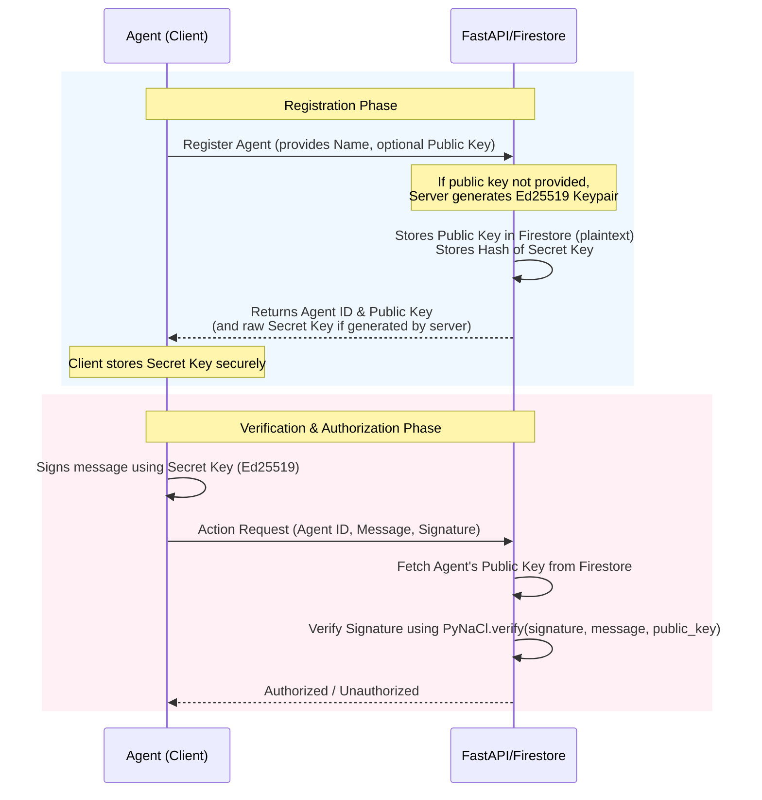

# AgentID Repository Analysis

This report presents a thorough static analysis of the AgentID repository based on code inspection. It examines runtime behaviors, key management flows, and explains the core modules of the project.

---

## 1. Do All Parts Run Flawlessly?

From a static code inspection, the system architecture is well-structured, but there are a few **critical configuration details** and **minor inconsistencies** to keep in mind:

### Backend Runtime & Database Access (`functions/main.py`)
* **Emulator Credentials**: The code gracefully handles local execution without production Google Cloud credentials. If it cannot load credentials, it dynamically generates a mock RSA key to satisfy the Firebase SDK and falls back to dummy credentials (lines 30-49).
* **Firestore Emulator Environment**: The backend relies on `firebase_admin` to access Firestore. When running locally, it requires the environment variable `FIRESTORE_EMULATOR_HOST=localhost:8080` to be set so that it communicates with the local emulator instead of attempting to connect to production GCP servers.
* **Audit Log Sort Index Fallback**: In `get_all_audit_logs()`, if the database fails to execute the ordered query (e.g., if Firestore composite indexes are not yet built), it catches the exception, fetches the logs unordered, and sorts them in-memory in Python. This prevents API crashes.

### Frontend API Routing & Vite Dev Server Proxying
* **Vite Proxy Target**: In `frontend/vite.config.js`, `/api` requests are proxied to `http://localhost:5001`.
  * **Potential Issue**: The standard Firebase Functions Emulator serves functions with a project/region path prefix, i.e., `http://localhost:5001/<project_id>/us-central1/app`. Therefore, proxying directly to `http://localhost:5001` might cause `/api/agents` to hit `http://localhost:5001/api/agents` and fail with a **404 Not Found**.
  * **Resolution**:
    1. Update the proxy target in Vite to include the full emulator prefix, or
    2. Route traffic through the Firebase Hosting Emulator on port `5000` (which applies `firebase.json` rewrite rules correctly), or
    3. Run FastAPI standalone via `python functions/main.py` on port `8080` and point the Vite proxy target to `http://localhost:8080`.
* **Missing Return Value in Dialog callback**: In `frontend/src/App.jsx`, `handleRegisterAgent` performs the POST request and updates state but does not return the created agent object. Meanwhile, in `RegisterAgentDialog.jsx` (line 48), it awaits `onRegister` and assigns the result to `newAgent` (which ends up as `undefined`). While it does not crash because `newAgent` is unused in the dialog after assignment, it is a minor code oversight.

### Live Demo Isolation
* **Local Simulation**: The `LiveDemoPanel.jsx` component uses purely mocked client-side functions (`mockVerifySignature`, `mockCheckPermission`, etc.) for signature validation and authorization. It does **not** make real HTTP requests to the backend verify/authorize endpoints. As a result, the live demo functions as a mock container and does not test the real backend integration.

---

## 2. How Private and Public Keys Are Handled

The application implements public-key cryptography (Ed25519) via **PyNaCl** on the backend and **tweetnacl** on the frontend to sign and verify request messages.

### Do Keys Exist in the Code?
* **No hardcoded private keys**: There are no raw private (secret) keys stored in any configuration or source files in the repository.
* **Database storage of keys**:
  * **Public Keys**: Stored as plaintext Hex/Base64 strings in Firestore inside the `credentials` collection (associated with each `agent_id`).
  * **Secret Keys**: **The database does not store raw private/secret keys.**
    * In `functions/main.py`, during agent registration, the server hashes the secret key (if generated by the server) using SHA-256 (`hash_secret_key`) and saves it under `secret_key_hash`.
    * In `seed.py`, it hashes the secret key using **Bcrypt** (`bcrypt.hashpw`) and saves it.
* **Demo-Only Hardcoded Seeds**: In `LiveDemoPanel.jsx` (frontend), two mock key pairs are dynamically generated in-memory using hardcoded string seeds:
  * `travel-agent` derived from `'TravelAgentSeed1234567890123456789012'`
  * `fake-travel-agent` derived from `'FakeTravelAgentSeed1234567890123456789012'`

### Key Management Flow

* **Client Signature Generation**: The client creates a payload (such as `agent_id:action:timestamp`) and signs it using its local Ed25519 secret key.
* **Backend Signature Verification**:
  1. The backend receives `signature`, `message`, and `agent_id`.
  2. It retrieves the registered `public_key` for that `agent_id` from Firestore.
  3. It decodes the public key and signature (supporting both Hex and Base64 representations).
  4. It uses PyNaCl's `VerifyKey` to verify that the message was signed by the corresponding private key.
  5. The raw secret key is never sent to the backend for verification, ensuring strict public-key cryptography principles.

---

## 3. Explanation of Major Files

### Backend & Database Initialization
1. **[functions/main.py](file:///e:/Rift/agent-pass-master/functions/main.py)**
   * **Role**: The main backend server logic.
   * **Details**: Built on FastAPI and wrapped in a Mangum adapter to deploy seamlessly on Google Cloud Functions (via Python functions-framework). It implements endpoints to register agents, verify signatures (`/verify`), check permissions (`/authorize`), fetch audit logs, and list all active agents. It interfaces directly with Firestore to read/write credentials, permissions, and log audit trails.
2. **[seed.py](file:///e:/Rift/agent-pass-master/seed.py)**
   * **Role**: Local database seeder.
   * **Details**: Initializes the Firestore database with sample data. It registers a default owner (`owner_demo`) and three mock agents (`TravelAgent`, `ShoppingAgent`, `ResearchAgent`), generating Ed25519 keypairs, hashing secret keys using Bcrypt, and seeding the database collections.

### Frontend React Application (SPA)
3. **[frontend/src/App.jsx](file:///e:/Rift/agent-pass-master/frontend/src/App.jsx)**
   * **Role**: Root component for the user interface.
   * **Details**: Manages global UI states, fetches lists of active agents from the backend, and handles the registration/revocation of agents by communicating with `/api/agents`.
4. **[frontend/src/components/LiveDemoPanel.jsx](file:///e:/Rift/agent-pass-master/frontend/src/components/LiveDemoPanel.jsx)**
   * **Role**: Interactive verification simulator.
   * **Details**: Simulates signature verification and role authorization logic directly in the browser using `tweetnacl`. It provides clickable scenario buttons (e.g., "Run as TravelAgent" or "TravelAgent attempts payment") to visually demonstrate the flow of identity check, permission check, and action outcomes.
5. **[frontend/src/components/AgentRegistry.jsx](file:///e:/Rift/agent-pass-master/frontend/src/components/AgentRegistry.jsx)**
   * **Role**: Agent management table.
   * **Details**: Displays a tabular view of all registered agents (Name, Owner, Status, Granted Permissions) and contains details modal triggers and revocation action triggers.
6. **[frontend/src/components/AuditLogViewer.jsx](file:///e:/Rift/agent-pass-master/frontend/src/components/AuditLogViewer.jsx)**
   * **Role**: Audit logging console.
   * **Details**: Displays database logs reflecting previous authentication and authorization attempts (success/failure indicators, timestamp, action type, agent ID) fetched from `/api/audit-log`.
7. **[frontend/src/components/RegisterAgentDialog.jsx](file:///e:/Rift/agent-pass-master/frontend/src/components/RegisterAgentDialog.jsx)**
   * **Role**: Registration modal form.
   * **Details**: Allows administrators to register a new agent by specifying its name, role, and public key.

### Configuration
8. **[firebase.json](file:///e:/Rift/agent-pass-master/firebase.json)**
   * **Role**: Firebase services configuration configuration.
   * **Details**: Configures Firestore rules and indexes, functions directories/runtimes, and sets hosting rewrites (directing all `/api/**` calls to the python function `app`, and other client paths to the single-page application entry `index.html`). It also sets local ports for Firestore, Functions, Hosting, and Emulator UI.
